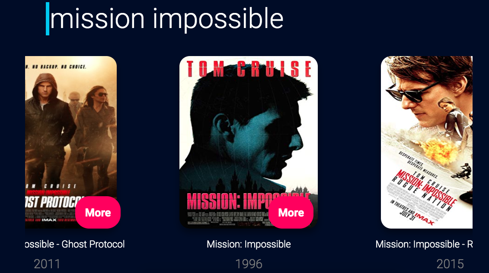
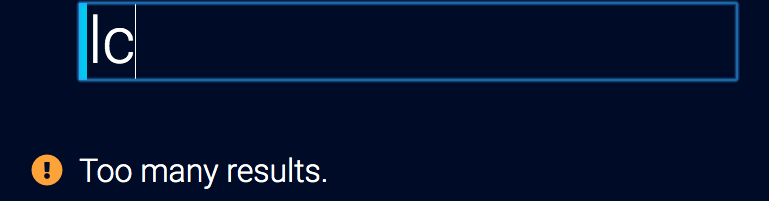

# vue-movie-app with slider

A simple movie finder and slider using the [OMDB Api](http://www.omdbapi.com/).

## Screenshots

### Type in a word or a title and press ENTER


### A carousel of movies is showed


### If it gets too many results an error is shown



## Project setup
Before you begin, you must install the dependecies by running:
```
npm install
```
### Compiles and hot-reloads for development
```
npm run serve
```

### Compiles and minifies for production
```
npm run build
```

### Run your unit tests
```
npm run test:unit
```

### Lints and fixes files
```
npm run lint
```

### Customize configuration
See [Configuration Reference](https://cli.vuejs.org/config/).
